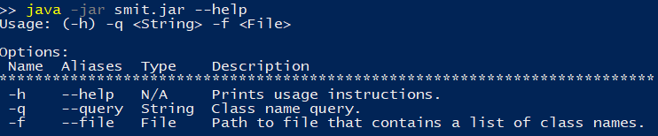

# Class Finder CLI
## Parameters
Language: **Java 8**

Build tool: **Maven 3**

Unit testing framework: **JUnit 5**

## Building the Artifact

1. Navigate to root folder;
2. Execute `mvn clean pkg`;
3. Maven will deposit the artifact into the `target` folder.

If you do not wish to build the artifact,
a copy has been added to this repository (`smit.jar`).

## Running the Artifact

1. Ensure Java version >= 8 runtime is installed on the system;
2. Use the tool via the following command: `<path to Java runtime> -jar <path to artifact>  <options>`
3. Running the tool without any arguments or with the `--help` option will display instructions.

## Usage

